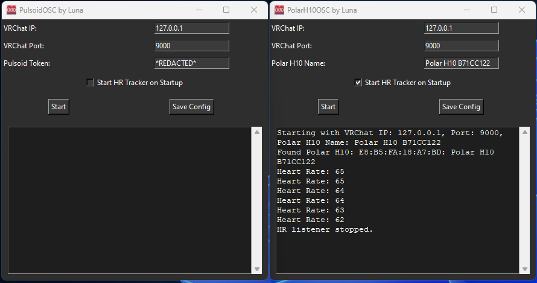

# LunaHR - Heart rate to VRChat through OSC 

If you like my project, please star it as it shows you're interested! <3

At this moment, its unsure if an H9 or other Polar devices would work with the PolarH10 script.

H10 and devices used with Pulsoid are the only confirmed to work at the current moment.
If you have another Polar monitor, please test my script with your device and let me know if it works! <3

[Consider supporting me on Ko-Fi :3](https://ko-fi.com/imlunauwu)

#### Please direct issues to me, I'd love to fix any.
^ Message me on Discord @ imlunauwu.

## Installs:

Everything should now be straightforward.

Get the Unity prefab here: https://github.com/ImLunaUwU/LunaHR/blob/main/LunaHR.unitypackage

Get the executable versions of the HR software from here: https://github.com/ImLunaUwU/LunaHR/tree/main/dist

The executable versions wont require you installing a bunch of things, as all dependencies are packaged within. For this reason, it also runs slightly better... Probably...

## Setup:

### Avatar
This project only uses 5 parameters (Using 33 just memory)!

The needed prefabs is in LunaHR.unitypackage (moved to releases). Avatar setup is as simple as any other VRCFury asset, and should be drag and drop onto your avatar.

Before importing LunaHR.unitypackage, please make sure you already have Poiyomi Toon (or Poi Pro) installed.
Alternatively, if you do not want to use Poi, you'd lack the BPM effect unless you set it up yourself.
This is slightly time consuming, but overall worth it if you're chronically online like me.

*HR Prefab should be dragged onto the avatar root itself.*

When adding to the avatar, the display defaults to be on your wrist/left lower arm bone. This can be changed by unpacking the prefab and changing armature link settings.

VRCFury should take care of all setup from this point. If not, please contact me because then I'd need to fix some things.

*In the most recent update HR Prefab can be left on before uploading, as it now uses VRCFury toggles.*

Feel free to customize materials to your liking.

### Polar H10
Everything is now configurable in the new GUI app.

### Pulsoid - PAID PLAN REQUIRED
Config is now simple and in a GUI. A token requires Pulsoid's "BRO" plan and can be found at https://pulsoid.net/ui/keys

## Credits and info
HEAVILY inspired by the (now inactive) project here: https://github.com/200Tigersbloxed/HRtoVRChat_OSC/

This project does NOT use the same parameters as the one by 200Tigersbloxed. It does use less though.
This is both because they're not meant to be the same, nor compatible, and also becuase everything in that project is outdated and the Unity files doesn't really work properly anymore.
*Feel free to use mine as a (semi-)direct replacement.*

#### Parameter configuration may come in the future, though is not currently a priority. 

The heart and text uses Poiyomi Toon, which you can get from Poi's Discord. https://discord.gg/poiyomi