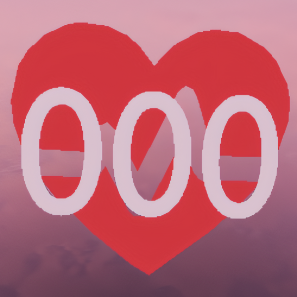
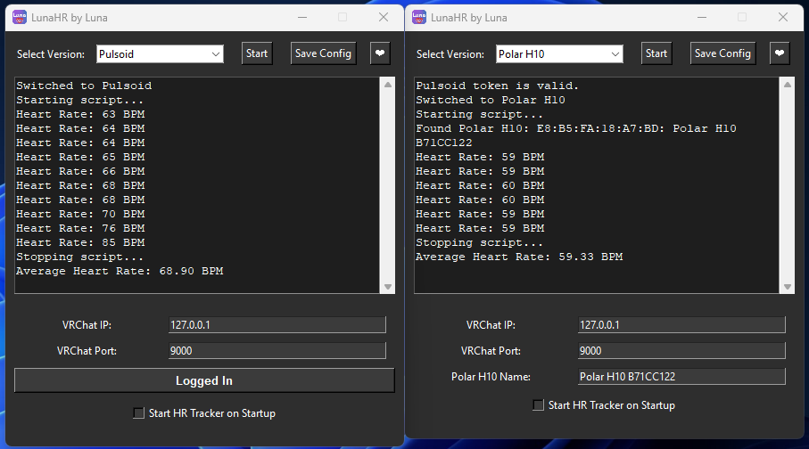

# LunaHR - Heart rate to VRChat through OSC 

If you like my project, please star it as it shows you're interested! <3

At this moment, its unsure if an H9 or other Polar devices would work with the PolarH10 script.

H10 and devices used with Pulsoid are the only confirmed to work at the current moment.
If you have another Polar monitor, please test my script with your device and let me know if it works! <3

[Consider supporting me on Ko-Fi :3](https://ko-fi.com/imlunauwu)

#### Please direct issues to me, I'd love to fix any.
^ Message me on Discord @ imlunauwu.

## Installs:

Everything should now be straightforward.

Get the Unity prefab here: [Quest compatible (33 bytes)](https://github.com/ImLunaUwU/LunaHR/blob/main/LunaHR%20(33%20bytes%2C%20works%20with%20quest).unitypackage), [PC only (9 bytes)](https://github.com/ImLunaUwU/LunaHR/blob/main/LunaHR%20(9%20bytes%2C%20not%20quest%20compatible).unitypackage)

Get the executable version of the HR software from here: [LunaHR.exe](https://github.com/ImLunaUwU/LunaHR/blob/main/dist/LunaHR.exe)

Older versions of the software, specifically before the merge does exist in the same directory.

## Setup:

### Avatar
The needed prefabs is in the unitypackages (see links above). Avatar setup is as simple as any other VRCFury asset, and should be drag and drop onto your avatar.

Before importing the unitypackage, please make sure you already have Poiyomi Toon (or Poi Pro) installed.
Alternatively, if you do not want to use Poi, you'd lack the BPM effect unless you set it up yourself.
This is slightly time consuming, but overall worth it if you're chronically online like me.

*HR Prefab should be dragged onto the avatar root itself.*

When adding to the avatar, the display defaults to be on your left wrist/left lower arm bone. This can be changed by unpacking the prefab and changing armature link settings.

VRCFury should take care of all setup from this point. If not, please contact me because then I'd need to fix some things.

*In the most recent update HR Prefab can be left on before uploading, as it now uses VRCFury toggles.*

Feel free to customize materials to your liking.

### Unified App
There is now a unified app (merged) which brings both the Pulsoid version and the Polar H10 version of this program into one.
This was done for the sake of convenience and to make things simpler for people to start using.

Note: The Polar version of the app may hang for a handful of seconds when stopping/quitting the app. This is because it is attempting to close the connection to the device to free it up for potential future use.

## Credits and info
HEAVILY inspired by the (now inactive) project here: https://github.com/200Tigersbloxed/HRtoVRChat_OSC/

This project does NOT use the same parameters as the one by 200Tigersbloxed. It does use less though.
This is both because they're not meant to be the same, nor compatible, and also becuase everything in that project is outdated and the Unity files doesn't really work properly anymore.
*Feel free to use mine as a (semi-)direct replacement.*

PC only prefab uses the [Simple Counter Shader](https://www.patreon.com/posts/simple-counter-62864361) from [RED_SIM](https://www.patreon.com/red_sim).

#### Parameter configuration may come in the future, though is not currently a priority. 

^ It is a pain in the ass to do this with the current script. Might happen if I do a complete overhaul.

The heart and text uses Poiyomi Toon, which you can get from Poi's Discord. https://discord.gg/poiyomi

As of right now I will not add support for another service for gathering heart rate data, I will instead work to improve the current app and assets.